```{r, echo=F}
knitr::opts_chunk$set(message = F, 
                      warning = F,
                      echo = F)
```

```{r}
library(sf)
library(rnaturalearth)
library(tidyverse)
library(geosphere)
# Making the interactive map
library(sp)
library(leaflet)
## Convert the Points df into shp
library(rgeos)
library(sf)
library(lwgeom)
library(units)
```

# Biodiversity changes are scale dependent

* **Global** biodiversity is **declining**

--

* **Local, regional or national** trends are **not always** similar

```{r, out.height = '430px'}
knitr::include_graphics("images/litrev.jpg")
```

---

# Biodiversity changes are scale dependent

* **Global** biodiversity is **declining**

* **Local, regional or national** trends are **not always** similar

<br><br><br><br>

.center[
### $\Rightarrow$ Dynamic processes (*i.e.* colonization, extinction, turnover...) vary with spatial scales
]

---

class: inverse, center, middle

## Biodiversity trends have to be assessed across spatial scales


---

# Scales


* **Spatial grain** 
<br><br><br>
.center[
```{r}
knitr::include_graphics("images/spatialgrain.jpg")
```
]


---

# Scales


* **Temporal grain**
<br><br><br>
.center[

```{r, out.width="80%"}
knitr::include_graphics("images/temporalgrain.jpg")
```
]

---

# Biodiversity data

* One dataset express the biodiversity at its specific spatial and temporal grains

* Data heterogeneity in spatial and temporal grains and extent

* Lack of data

<br><br>
## Problem: 

With the actual data, it is impossible to assess biodiversity trends for a continuum of spatial scales.

---

# Spatial aggregation

**Jarzyna *et al* (2015)** 


<br><br><br><br><br><br><br>
**Chase *et al.* (2019)**

.center[

```{r, out.width="40%"}
knitr::include_graphics("images/chase_2019.PNG")
```

]

---

# Model

.pull-left[

* Use biodiversity data with heterogeneous: **spatial grain, temporal grain, location, spatial extent and temporal extent**.

* Use this component as **covariates** to predict species richness

* Tree based models: flexibility models the interactions between *species area relationship* and their location in space and time. 

]

.pull-right[
```{r}
knitr::include_graphics("images/keil_chase_2022.PNG")
```
.credit[Keil & Chase 2022, preprint]
]

--

**In practice:**
```
treeBasedModel(species richness ~ area,
                                  latitude,
                                  longitude,
                                  date,
                                  temporal grain)
```

---

# Species richness and spatial scale : the SAR

.pull-left[
<br><br>
- **SAR** = Species Area Relationship (Arrhenius 1921)

<br><br><br>
- Linear on a log-log scale

<!-- <br> -->
<!-- - The slope indicates the spatial $\beta-diversity$ -->

<!-- <br> -->
<!-- - Can be used to extrapolate species richness (*e.g.* Kunin *et al.* 2018) -->

]

.pull-right[
```{r, out.height = '430px'}
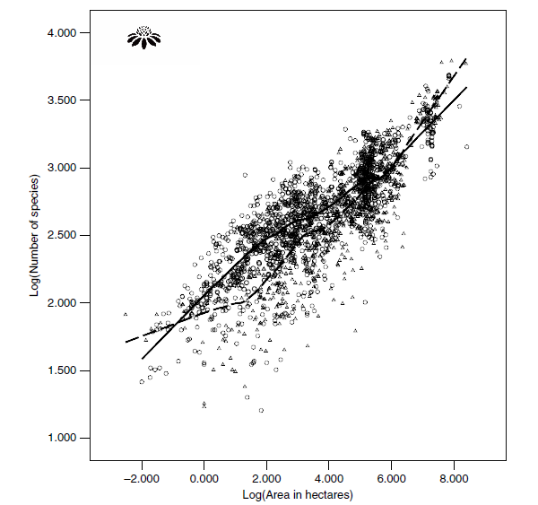
```
.credit[Brown *et al.* 2007]

]


---

# Species richness and temporal scale: the STR

.pull-left[

<br><br>
- **STR** = Species-Time Relationship

<br><br><br>
- Can also be well described by a power law

<!-- <br> -->
<!-- - Emerges from both sampling and ecological processes -->

<!-- <br> -->
<!-- .center[**And... we don't know much more about it**] -->
]

.pull-right[

```{r, out.height = '430px'}
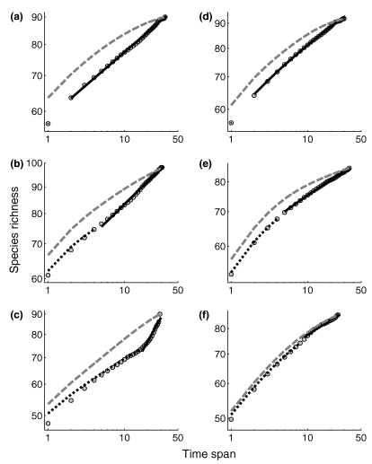
```
.credit[STR of the Breeding Bird Survey for different North American states, White 2004]

]

---

# Species richness, space and time: the STAR

.pull-left[

<br>
- **STAR** = Species-Time-Area Relationship

<!-- <br> -->
<!-- - Results from both environmental variability and biological processes -->

<br><br><br>

<!-- The STAR raises the question:  -->

<!-- <br> -->
.center[**Temporal and spatial scales highly drive species richness**]

]

.pull-right[
```{r}
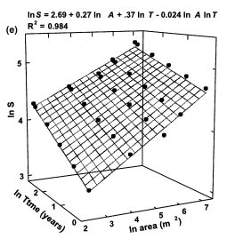
```
.credit[Plant species richness as a function of interacting space and time, Adler & Lauenroth 2003]
]

---

class: inverse, center, middle

What about the relationship between space, time and...

## Species richness <span style="color: red;">trends</span> ?

---

# Biodiversity changes and spatial scales

<br><br>
.pull-left[
* According to the taxa:

.center[*"Species richness change can increase, decrease, reverse or be unimodal accross spatial scales."*]

* For North American birds, larger spatial scales seem to increase positively the species richness (Oikos, Chase *et al* 2019)
<br>

]

.pull-right[

.center[
```{r, out.width="100%"}
knitr::include_graphics("images/chase_2019.PNG")
```
]

]

---

# Biodiversity changes and temporal scales...

<br><br><br>
.center[...nothing in sight in the scientific literature]

---

class: inverse, center, middle

# Problematic:

### What are the links between <span style="color: red;">species-richness trends</span> and <span style="color: red;">spatio-temporal scales</span>?

--


<br><br><br>
<b>Taxon:</b> Birds

<b>Location:</b> So far Czech Republic

<b>Methods:</b> Machine learning (CART, GLM...)

---

class: inverse, center, middle

# Goal

Use heterogeneous avian biodiversity datasets to model species richness trends across continuums of space and time scales

.center[
```{r}

```
]

---

# Datasets

<br>
We need heterogeneous datasets with:

* Time series (for the trend)

* Several spatial scales

* Several temporal scales

<br><br>
2 datasets: 

1. The **atlas** data from the Czech Society for Ornithology (Česká společnost ornitologická). Courtesy of Vladimír Bejček, Karel Šťastný and Ivan Mikuláš.

2. Local time series from the **Breeding Bird Survey** (Jednotný program sčítání ptáků). Courtesy of Jiří Reif. 

---

<!-- # The Atlas dataset -->

<!-- ```{r} -->
<!-- ## Load the shps -->
<!-- shps_names <- list.files("../phd/data/czech_bird/ATLASCR_DATA/Shapefile_Quadrats_CR/")[grepl("shp(?!.*xml)",                                                                list.files("../phd/data/czech_bird/ATLASCR_DATA/Shapefile_Quadrats_CR/"), perl = T)] -->

<!-- shps_path <-  -->
<!-- list.files("../phd/data/czech_bird/ATLASCR_DATA/Shapefile_Quadrats_CR/", full.names = TRUE)[grepl("shp(?!.*xml)",                                                                list.files("../phd/data/czech_bird/ATLASCR_DATA/Shapefile_Quadrats_CR/"), perl = T)] -->

<!-- for(i in 1:length(shps_names)){ -->

<!--   assign(shps_names[i], -->
<!--          st_read(shps_path[i], quiet = T) %>% st_transform(., crs = 4326)) -->
<!-- } -->

<!-- # Loading the countries shp: -->
<!-- shp_country <- ne_countries(scale = "medium", returnclass = "sf") -->
<!-- ``` -->

<!-- .pull-left[ -->

<!-- .center[**Temporal scales**] -->

<!-- 4 time periods, 3 different time spans: -->

<!-- * M1 = 1973-1977 (**5 years**) -->

<!-- * M2 = 1985-1989 (**5 years**) -->

<!-- * M3 = 2001-2003 (**3 years**) -->

<!-- * M4 = 2014-2017 (**4 years**) -->
<!-- ] -->

<!-- .pull-right[ -->

<!-- .center[**Spatial scales**] -->

<!-- Ranging from less than **100 Km** $^2$ to **80 000 Km** $^2$ (the entire Czech Republic) -->
<!-- ] -->

<!-- --- -->

<!-- # The Atlas dataset -->

<!-- ```{r} -->
<!-- for(i in 1:length(shps_names)){ -->

<!--   assign( paste0("map", shps_names[i]), -->
<!--     get(shps_names[i]) %>%  -->
<!--     ggplot()+ -->
<!--     geom_sf()+ -->
<!--     geom_sf(data = shp_country, color = "black", fill = NA)+ -->
<!--     coord_sf(xlim = c(12, 19), ylim = c(48.5, 51)) + -->
<!--     theme(panel.background = element_blank(), -->
<!--           axis.title.x=element_blank(), -->
<!--           title = element_blank(), -->
<!--           # plot.margin = unit(c(-8,0,-5,2), "cm"), -->
<!--           legend.position = "none") -->
<!--   ) -->

<!-- } -->

<!-- ``` -->


<!-- ```{r, fig.width=15, fig.height=10} -->
<!-- library(cowplot) -->

<!-- ggdraw()+ -->
<!--   draw_plot(mapm1_kvadraty.shp, x = 0, y = .5, width = .5, height = .5) + -->
<!--   draw_plot(mapKvadratyCR_JTSK.shp, x = .5, y = .5, width = .5, height = .5) + -->
<!--   draw_plot(mapKvadratyCR_JTSK20.shp, x = 0, y = 0, width = .5, height = .5) + -->
<!--   draw_plot(mapKvadratyCR_JTSK40.shp, x = .5, y = 0, width = .5, height = .5) -->
<!-- ``` -->

<!-- --- -->

<!-- # The BBS dataset -->

<!-- * Local time series -->

<!-- * 350 transects -->

<!-- * 20 census points per transect -->

<!-- * From 1982 to 2020 -->

<!-- * At least 2 censuses per transect and per year -->

<!-- * 4 different **spatial scales** -->

<!-- * **Temporal scales** ranging from 0.5 year to decades -->


<!-- --- -->

<!-- # The BBS dataset -->

<!-- ```{r} -->
<!-- ## Load the database -->
<!-- load(file = "../phd/data/czech_bird/JPSP/jpsp_data.Rdata") -->

<!-- ## First, replace the error in the CENSUSES_pa db -->
<!-- CENSUSES_pa$CensusId[CENSUSES_pa$RecogDist == -4] <- 1 -->

<!-- ## Add the rownumber into an id column for the last left_join() -->
<!-- Points <- Points %>% rownames_to_column(var = "id") -->

<!-- ## Create the vector of transect numbers -->
<!-- transID <- unique(Points$Transect) -->

<!-- ## Create the tibble that will contain the distance for each transect -->
<!-- alldist <- tibble::tibble( -->
<!--   id = numeric(), -->
<!--   Transect = numeric(), -->
<!--   Latitude = numeric(), -->
<!--   Longitude = numeric(), -->
<!--   sumdist = numeric() -->
<!-- ) -->

<!-- for (i in 1:length(transID)) { -->

<!--   ## Filter the data for the transect -->
<!--   tmp <- -->
<!--     Points %>%  -->
<!--     dplyr::filter(Transect == transID[i]) %>% -->
<!--     dplyr::select(id, Transect, Latitude, Longitude) -->

<!--   ## Create the empty vector that will contain the distance between each point -->
<!--   dist <- vector() -->


<!--   ## Compute the distance between 2 points -->
<!--   for(j in 2:(nrow(tmp) - 1)) { -->

<!--     dist[j-1] <- distm(c(tmp$Longitude[j], tmp$Latitude[j]), -->
<!--                        c(tmp$Longitude[j+1], tmp$Latitude[j+1]), -->
<!--                        fun = distGeo) -->

<!--   } -->


<!--   ## Sum the distances to know the length of the transect -->
<!--   sumdistm <- sum(dist) -->

<!--   ## Update the matrix that contains all the distances -->
<!--   alldist <- -->
<!--     rbind(alldist, cbind(tmp, sumdistm)) -->

<!-- } -->

<!-- ## Join the transect distance to the Points database -->
<!-- Points <- -->
<!--   alldist %>%  -->
<!--   dplyr::left_join(Points, alldist, by = c("id", "Transect", "Latitude", "Longitude")) %>% -->
<!--   column_to_rownames(var = "id") -->

<!-- ## Converting the Points dataset into an sf object -->
<!-- points_as_shp <-  -->
<!-- Points %>%  -->
<!--   filter_at(vars(Latitude, Longitude), any_vars(!is.na(.))) %>% ## the function doesn't accept NA for long and lat  -->
<!--   st_as_sf(coords = c("Longitude", "Latitude"), crs = 4326) -->


<!-- # Computing the convex hull of each transect -->

<!-- ## If I want to compute the convex hull of the transect, I need to convert to points into polygons -->
<!-- polygons_transect <- -->
<!-- points_as_shp %>%  -->
<!--   filter(Transect != 21) %>%  ## add to withdraw the transect 21 composed of only 1 point  -->
<!--   dplyr::group_by(Transect) %>%  -->
<!--   dplyr::summarise() %>% -->
<!--   st_cast("POLYGON") %>%  -->
<!--   st_convex_hull() %>%   ## transform the inner polygons into outer polygons -->
<!--   mutate(transect_area = st_area(.)) ## create the column containing the area -->

<!-- ## Convert the m² into km² (*10^(-6)) -->
<!-- polygons_transect$transect_area <- set_units(polygons_transect$transect_area, km^2) -->


<!-- ## Converting the Points dataset into an sf object -->
<!-- points_as_shp <-  -->
<!-- Points %>%  -->
<!--   filter_at(vars(Latitude, Longitude), any_vars(!is.na(.))) %>% ## the function doesn't accept NA for long and lat  -->
<!--   st_as_sf(coords = c("Longitude", "Latitude"), crs = 4326) -->

<!-- polygons_transect <- -->
<!-- points_as_shp %>%  -->
<!--   count(Transect) %>%  -->
<!--   mutate(points_area_200 = (pi*.2^2)*n, -->
<!--          points_area_100 = (pi*.1^2)*n) %>% ## compute the area of all points with a radius of 200m -->
<!--   as.data.frame() %>% ## because you can't merge 2 sf objects --' -->
<!--   select(Transect, points_area_200, points_area_100) %>%  -->
<!--   merge(polygons_transect, by = "Transect") -->

<!-- ## Convert the points area to unit format for sf object -->
<!-- polygons_transect$points_area_200 <- set_units(polygons_transect$points_area_200, km^2) -->
<!-- polygons_transect$points_area_100 <- set_units(polygons_transect$points_area_100, km^2) -->


<!-- ############################################# -->
<!-- # Now let's compute the ratio between the hull and the points area -->
<!-- polygons_transect <- -->
<!--   polygons_transect %>%  -->
<!--   mutate(polypoint_ratio_200m = ifelse(.$points_area_200 > .$transect_area,  -->
<!--                                   1, .$transect_area/.$points_area_200), -->
<!--          polypoint_ratio_100m = ifelse(.$points_area_100 > .$transect_area, -->
<!--                                        1, .$transect_area / .$points_area_100)) %>%  -->
<!--   st_as_sf() ## put the data back into sf object -->


<!-- ## Set the colors for the points -->
<!-- colpal <- colorFactor(topo.colors(20), Points$Point) -->
<!-- # colpal2 <- colorFactor(topo.colors(nrow(polygons_transect)),  -->
<!-- #                        polygons_transect$polypoint_ratio) -->

<!-- # Create the base map -->
<!-- m <- -->
<!--   leaflet() %>%  -->
<!--   setView(lat = 50, lng = 15.5, zoom=7.3) %>% -->
<!--   addTiles(group="OSM") %>%  -->
<!--   addPolygons(data = polygons_transect, -->
<!--               group = "Transect area") -->

<!-- ``` -->

<!-- ```{r, out.width="100%"} -->
<!-- ## Loop for drawing every transect and points -->
<!-- for (i in unique(Points$Transect)) { -->
<!--     m <- m %>%  -->
<!--         addPolylines(data = Points[Points$Transect == i, ],  -->
<!--                      lng = ~Longitude,  -->
<!--                      lat = ~Latitude,  -->
<!--                      label = ~Transect,  -->
<!--                      color = "black",  -->
<!--                      weight = 2) %>%  -->
<!--         addCircles(data = Points[Points$Transect == i, ], -->
<!--                          lng = ~Longitude,  -->
<!--                          lat = ~Latitude,  -->
<!--                          label = ~Point, -->
<!--                          radius = 200,  ## In meters -->
<!--                          color = ~colpal(Point), -->
<!--                          group = "Points", -->
<!--                          fillOpacity = .8)%>%  -->
<!--         addLayersControl( -->
<!--         overlayGroups = c("Points", "Transect area"), -->
<!--         options = layersControlOptions(collapsed = F)) -->
<!-- } -->


<!-- m -->
<!-- ``` -->

<!-- --- -->

<!-- class: inverse, center, middle -->

<!-- # Data analysis -->

<!-- --- -->

<!-- # Species richness trend across spatial scales -->

<!-- * For each spatial scale, we computed the **species richness trend** (slope of linear regression) -->

<!-- * 3 points in time (1987, 2002, 2015) -->

<!-- * Harmonization of the two datasets -->

<!-- --- -->

<!-- # Species richness trend across spatial scales -->

<!-- ```{r, out.width="95%"} -->
<!-- 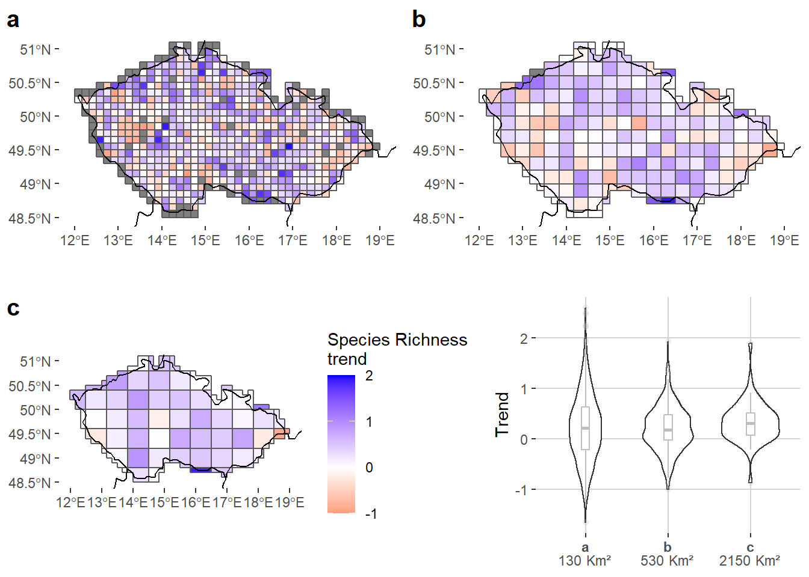 -->
<!-- ``` -->

<!-- --- -->

<!-- # Species richness trend across spatial scales -->

<!-- ```{r, out.width="95%"} -->
<!-- 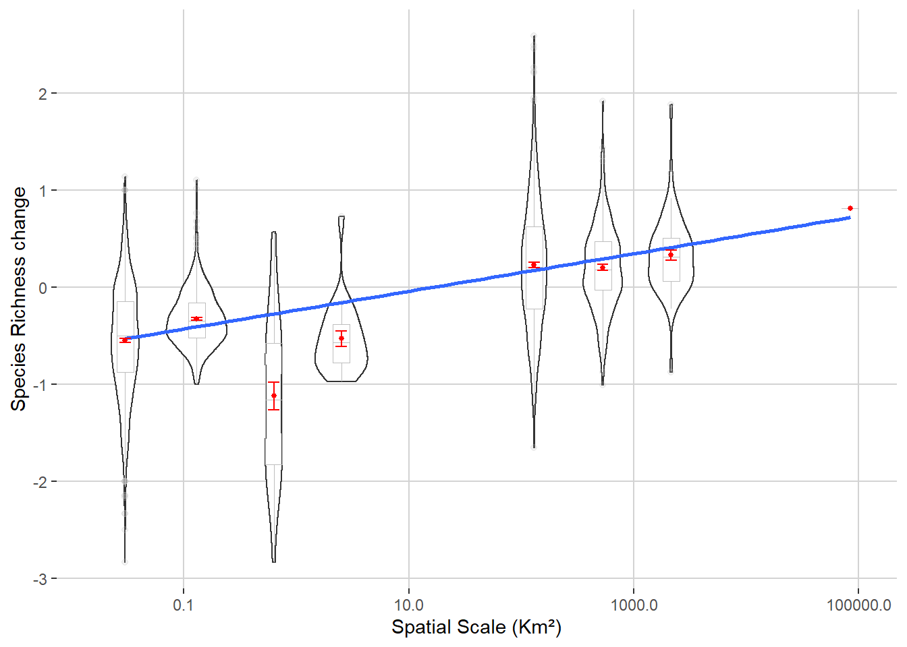 -->
<!-- ``` -->
<!-- --- -->

<!-- # Species richness trend across spatial scales -->

<!-- .pull-left[ -->

<!-- * Increasing species richness trend with spatial scale -->

<!-- * Coherent with Chase *et. al* 2019 -->

<!-- * Easier extirpation at smaller scales -->

<!-- * Lower proportion of extinction with increasing scales (Keil *et. al* 2018) -->

<!-- * More habitat heterogeneity at larger scales -->
<!-- ] -->
<!-- .pull-right[ -->
<!-- <br> -->
<!-- ```{r, out.width="95%"} -->
<!--  -->
<!-- ``` -->
<!-- ] -->

<!-- .center[ -->
<!-- <br> -->
<!-- **Question:** is this result observed for a continuum of spatial scales?  -->
<!-- ] -->


<!-- --- -->

<!-- class: inverse, center, middle  -->

<!-- # Modeling -->

<!-- --- -->

<!-- # Random Forest -->

<!-- 1. Understand the drivers of species richness changes -->

<!-- 2. Predict the species richness -->

<!-- Predictions will allow me to fill the boxplot gaps, spatial and temporal gaps of the datasets  -->

<!-- <br> -->

<!-- **Formula:** -->

<!-- ```{r, echo=T, eval=F} -->
<!-- randomForest(sr ~ Lat + Long + AREA + Date + polypoint_ratio + time_span) -->
<!-- ``` -->

<!-- --- -->

<!-- # Partial plots -->

<!-- .center[ -->

<!-- *Species-time relationship (STR) through time* -->

<!-- ```{r, out.width="50%"} -->
<!-- 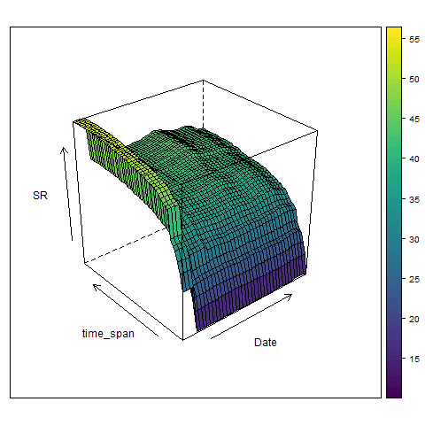 -->
<!-- ``` -->

<!-- ] -->


<!-- --- -->


<!-- # Predicitons -->

<!-- * For <span style="color: blue;">50 $Km²$</span> and <span style="color: blue;">10 000 $Km²$</span> -->


<!-- .pull-left[ -->
<!-- <br> -->
<!-- ```{r, out.width="100%"} -->
<!-- 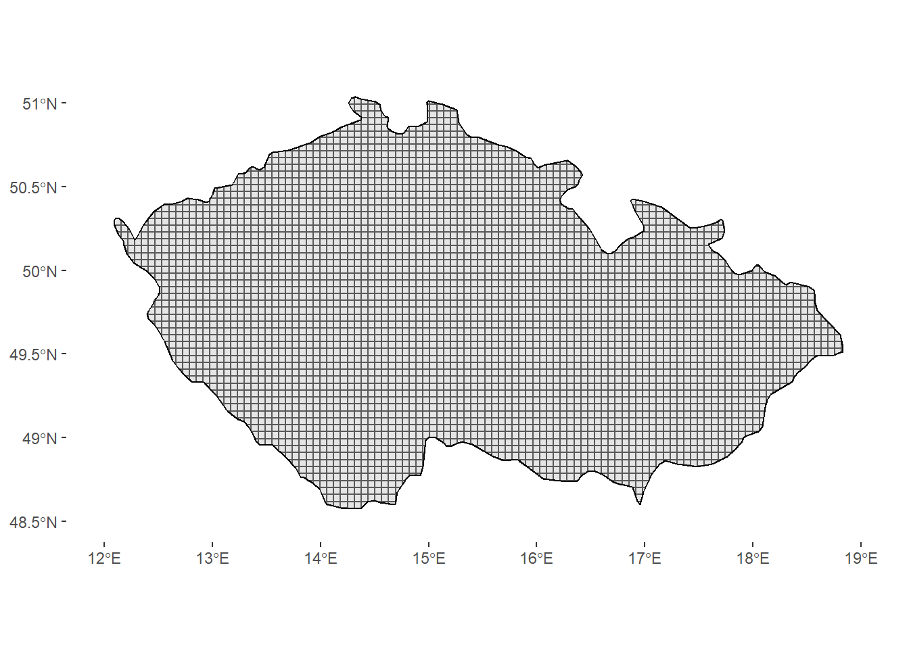 -->
<!-- ``` -->
<!-- ] -->


<!-- .pull-right[ -->
<!-- <br> -->
<!-- ```{r, out.width="100%"} -->
<!-- 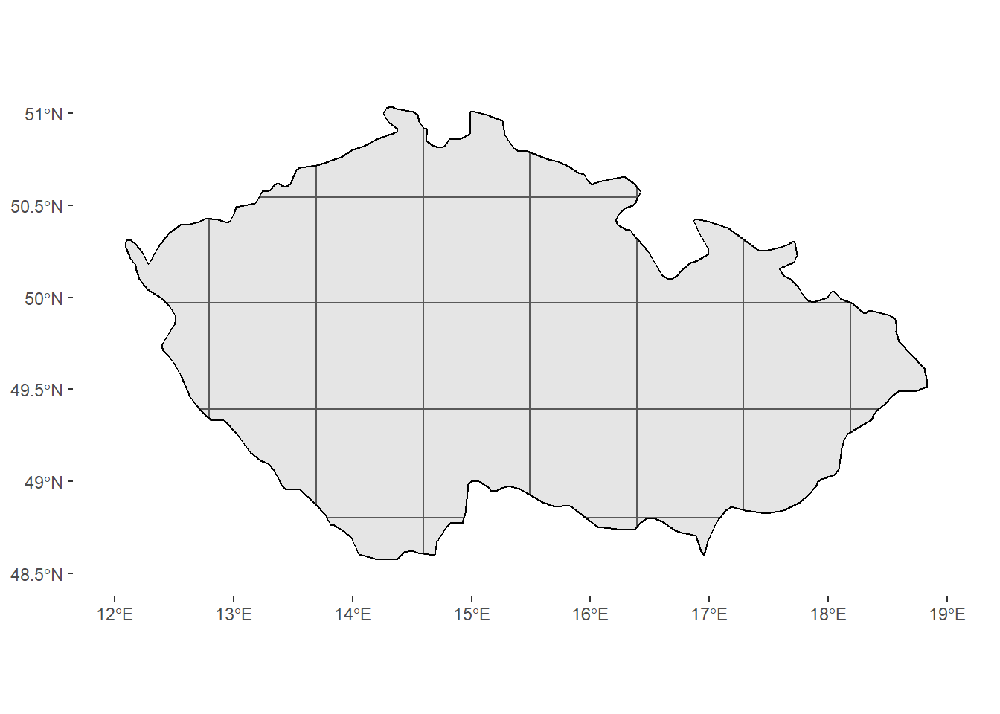 -->
<!-- ``` -->

<!-- ] -->

<!-- --- -->

<!-- # Predicitons -->

<!-- * For <span style="color: blue;">50 $Km²$</span> and <span style="color: blue;">10 000 $Km²$</span> -->


<!-- .center[ -->
<!-- ```{r, out.width="87%"} -->
<!-- 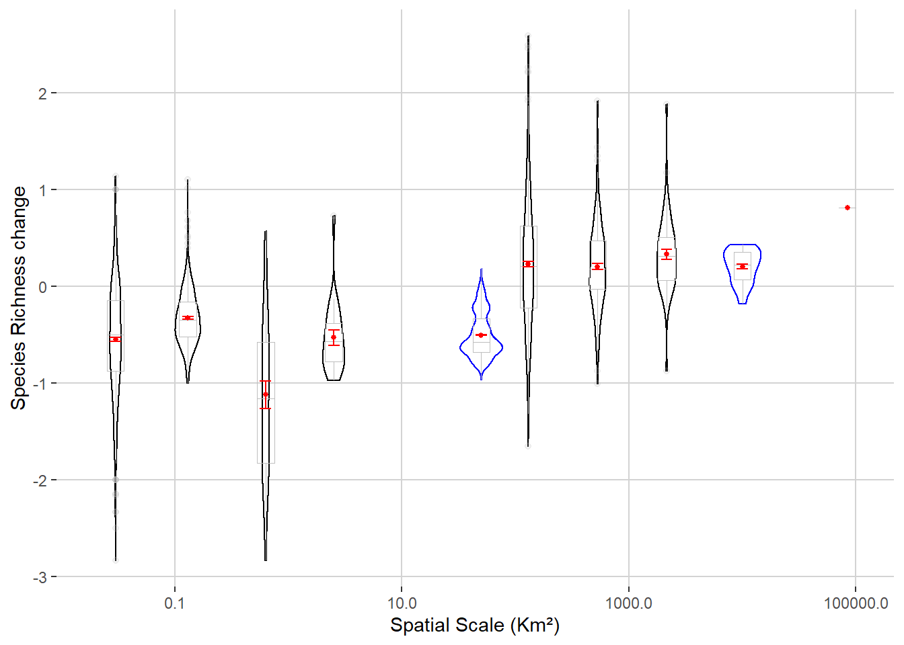 -->
<!-- ``` -->
<!-- ] -->

<!-- --- -->

<!-- # Next steps -->

<!-- <br> -->
<!-- * Take into account the sampling effort -->

<!-- <br> -->
<!-- * Take into account environmental covariates to understand at which scales they interact with biodiversity dynamic -->

<!-- <br> -->
<!-- * Explore the link with temporal scales -->

<!-- <br> -->
<!-- * Enlarge the model to Europe -->

<!-- <br> -->
<!-- * Study other biodiversity metrics and other taxa (lepidopterans, amphibians...) -->


<!-- --- -->

<!-- class: inverse, center, middle -->

<!-- # Thank you for your attention -->


<!-- .footnote[ -->
<!-- Email: leroy@fzp.czu.cz -->

<!-- Twitter: @FrsLry -->
<!-- ] -->

<!-- --- -->

<!-- class: inverse, center, middle -->

<!-- ## Supplementary slides -->

<!-- --- -->

<!-- # Observed vs. predicted -->

<!-- .center[ -->
<!-- ```{r, out.width="80%"} -->
<!-- knitr::include_graphics("images/obs_vs_pred.png") -->
<!-- ``` -->
<!-- ] -->

<!-- --- -->

<!-- # SAR and STR -->

<!-- .pull-left[ -->

<!-- .center[**The SAR**] -->

<!-- ```{r, out.width="100%"} -->
<!-- 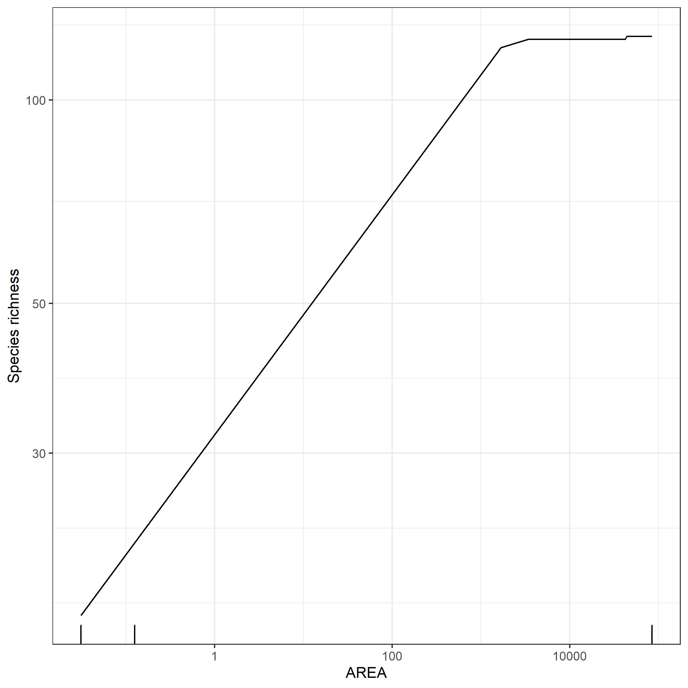 -->
<!-- ``` -->

<!-- ] -->

<!-- .pull-right[ -->

<!-- .center[**The STR**] -->

<!-- ```{r, out.width="100%"} -->
<!-- 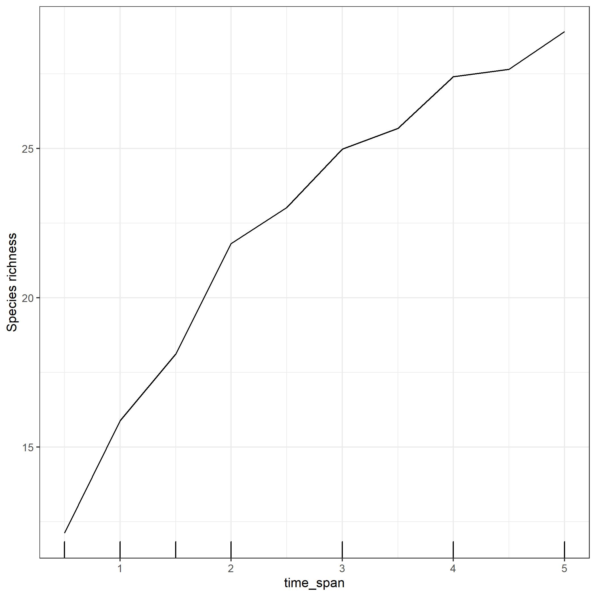 -->
<!-- ``` -->

<!-- ] -->
