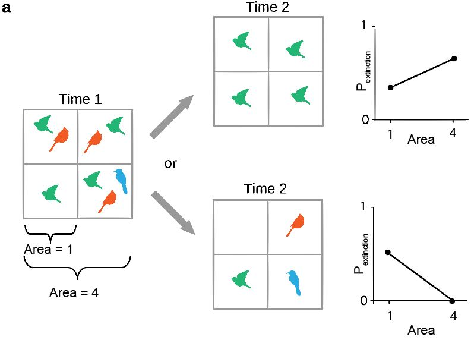
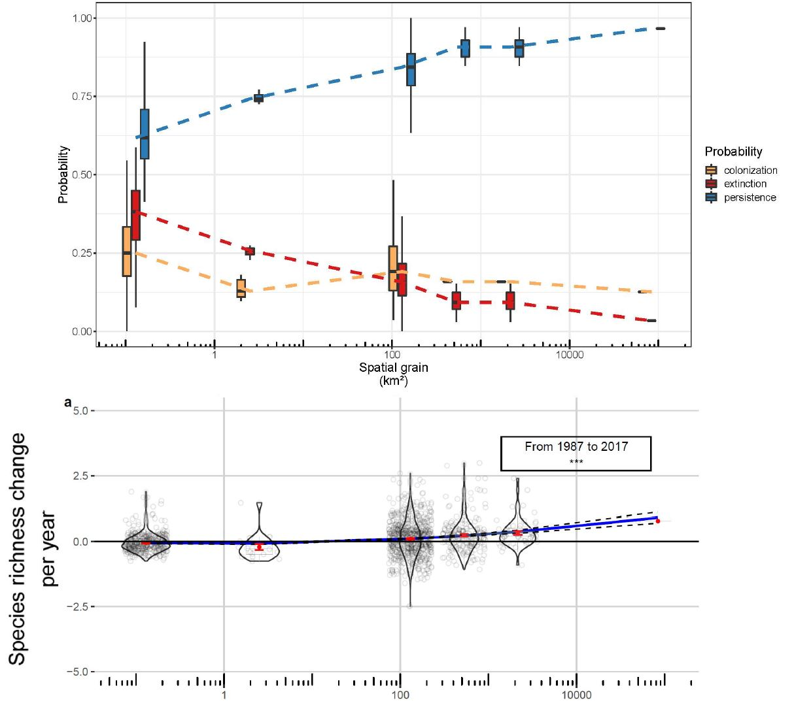

```{r, echo=F}
knitr::opts_chunk$set(message = F, 
                      warning = F,
                      echo = F)
```

```{r}
library(sf)
library(rnaturalearth)
library(tidyverse)
library(geosphere)
# Making the interactive map
library(sp)
library(leaflet)
## Convert the Points df into shp
library(rgeos)
library(sf)
library(lwgeom)
library(units)
library(icons)

## to build the pdf
# xaringanBuilder::build_pdf("index.html", partial_slides = T, complex_slides = T)
```

# Biodiversity changes are scale dependent

* **Global** biodiversity is **declining**

--

* **Local, regional or national** trends are **not always** similar

```{r, out.height = '430px'}
knitr::include_graphics("images/litrev.jpg")
```

---

# Biodiversity changes are scale dependent

* **Global** biodiversity is **declining**

* **Local, regional or national** trends are **not always** similar

<br><br><br>

.center[
### $\Rightarrow$ Dynamic processes (*i.e.* colonization, extinction, turnover...) vary with spatial scales
]

--

<br>
.center[
### $\Rightarrow$ Biodiversity trends have to be assessed across spatial scales
]

---

class: inverse, center, middle

# Objectives

<br><br>
### $\Rightarrow$ How are avian biodiversity changes scale dependent across Czechia?

<br><br>
### $\Rightarrow$ Why do we observe this scale dependency of biodiversity changes?
---

# Scales


* **Spatial scale** $=$ **Spatial grain**   
<br><br><br>
.center[
```{r}
knitr::include_graphics("images/spatialgrain.jpg")
```
]

---

# Scales


* **Temporal scale** $=$ **Temporal grain**
<br><br><br>
.center[

```{r, out.width="80%"}

```
]

---

# Biodiversity data

* One dataset express the biodiversity at its specific spatial and temporal grains

* Data heterogeneity in spatial and temporal grains and extent

* Lack of data

--

<br><br>
## Problem: 

With the actual data, it is not straight forward to assess biodiversity trends for a continuum of spatial scales

---

# Spatial aggregation

**Jarzyna *et al.* (2015)**
<br><br><br>
.center[
```{r, out.height="150%"}

```
]

---

# Spatial aggregation

**Chase *et al.* (2019)**

.center[

```{r, out.width="75%"}

```

]

---

# Model

.pull-left[

* Use biodiversity data with heterogeneous: **spatial grain, temporal grain, location, spatial extent and temporal extent**.

<br><br>
* Use this component as **covariates** to predict species richness at desired (spatial & temporal) grain and location (in space & time) 


]

.pull-right[
```{r}

```

.center[
```{r, out.width="75%"}

```
]


]

---

# Model

<br><br>
**In practice:**

```
treeBasedModel(species richness ~ area,           -> Species-area relationship 
                                  temporal grain, -> Species-time relationship
                                  latitude,       -> Location in space
                                  longitude,      -> Location in space
                                  date)           -> Location in time
```
<br>
Tree based models: the flexibility grasps the interactions between **species area/time relationship** and their location in space and time. 

The species-area and species-time relationships allows to down/upscale species richness

--

<br>
.center[
### $\Rightarrow$ We need data at different spatial and temporal grains
]


---

# Bird atlas of the Czech Republic

.pull-left[

.center[**Spatial scales**]

Large scale dataset. Ranging from less than **100 Km** $^2$ to **80 000 Km** $^2$ (the entire Czech Republic)

```{r}

```

]

.footnote[
Courtesy of Vladimír Bejček, Karel Šťastný and Ivan Mikuláš
]

.pull-right[

.center[**Temporal scales**]

3 time periods, 3 different time spans:

* M2 = 1985-1989 (**5 years**)

* M3 = 2001-2003 (**3 years**)

* M4 = 2014-2017 (**4 years**)

]


--

<br><br>
.center[
### $\Rightarrow$ The model homogenize the temporal grain and the sampling effort
]

---

# Breeding bird survey (BBS)


```{r}
## Load the database
load(file = "../phd/data/czech_bird/JPSP/jpsp_data.Rdata")

## First, replace the error in the CENSUSES_pa db
CENSUSES_pa$CensusId[CENSUSES_pa$RecogDist == -4] <- 1

## Add the rownumber into an id column for the last left_join()
Points <- Points %>% rownames_to_column(var = "id")

## Create the vector of transect numbers
transID <- unique(Points$Transect)

## Create the tibble that will contain the distance for each transect
alldist <- tibble::tibble(
  id = numeric(),
  Transect = numeric(),
  Latitude = numeric(),
  Longitude = numeric(),
  sumdist = numeric()
)

for (i in 1:length(transID)) {

  ## Filter the data for the transect
  tmp <-
    Points %>%
    dplyr::filter(Transect == transID[i]) %>%
    dplyr::select(id, Transect, Latitude, Longitude)

  ## Create the empty vector that will contain the distance between each point
  dist <- vector()


  ## Compute the distance between 2 points
  for(j in 2:(nrow(tmp) - 1)) {

    dist[j-1] <- distm(c(tmp$Longitude[j], tmp$Latitude[j]),
                       c(tmp$Longitude[j+1], tmp$Latitude[j+1]),
                       fun = distGeo)

  }


  ## Sum the distances to know the length of the transect
  sumdistm <- sum(dist)

  ## Update the matrix that contains all the distances
  alldist <-
    rbind(alldist, cbind(tmp, sumdistm))

}

## Join the transect distance to the Points database
Points <-
  alldist %>%
  dplyr::left_join(Points, alldist, by = c("id", "Transect", "Latitude", "Longitude")) %>%
  column_to_rownames(var = "id")

## Converting the Points dataset into an sf object
points_as_shp <-
Points %>%
  filter_at(vars(Latitude, Longitude), any_vars(!is.na(.))) %>% ## the function doesn't accept NA for long and lat
  st_as_sf(coords = c("Longitude", "Latitude"), crs = 4326)


# Computing the convex hull of each transect

## If I want to compute the convex hull of the transect, I need to convert to points into polygons
polygons_transect <-
points_as_shp %>%
  filter(Transect != 21) %>%  ## add to withdraw the transect 21 composed of only 1 point
  dplyr::group_by(Transect) %>%
  dplyr::summarise() %>%
  st_cast("POLYGON") %>%
  st_convex_hull() %>%   ## transform the inner polygons into outer polygons
  mutate(transect_area = st_area(.)) ## create the column containing the area

## Convert the m² into km² (*10^(-6))
polygons_transect$transect_area <- set_units(polygons_transect$transect_area, km^2)


## Converting the Points dataset into an sf object
points_as_shp <-
Points %>%
  filter_at(vars(Latitude, Longitude), any_vars(!is.na(.))) %>% ## the function doesn't accept NA for long and lat
  st_as_sf(coords = c("Longitude", "Latitude"), crs = 4326)

polygons_transect <-
points_as_shp %>%
  count(Transect) %>%
  mutate(points_area_200 = (pi*.2^2)*n,
         points_area_100 = (pi*.1^2)*n) %>% ## compute the area of all points with a radius of 200m
  as.data.frame() %>% ## because you can't merge 2 sf objects --'
  select(Transect, points_area_200, points_area_100) %>%
  merge(polygons_transect, by = "Transect")

## Convert the points area to unit format for sf object
polygons_transect$points_area_200 <- set_units(polygons_transect$points_area_200, km^2)
polygons_transect$points_area_100 <- set_units(polygons_transect$points_area_100, km^2)


#############################################
# Now let's compute the ratio between the hull and the points area
polygons_transect <-
  polygons_transect %>%
  mutate(polypoint_ratio_200m = ifelse(.$points_area_200 > .$transect_area,
                                  1, .$transect_area/.$points_area_200),
         polypoint_ratio_100m = ifelse(.$points_area_100 > .$transect_area,
                                       1, .$transect_area / .$points_area_100)) %>%
  st_as_sf() ## put the data back into sf object


## Set the colors for the points
colpal <- colorFactor(topo.colors(20), Points$Point)
# colpal2 <- colorFactor(topo.colors(nrow(polygons_transect)),
#                        polygons_transect$polypoint_ratio)

# Create the base map
m <-
  leaflet() %>%
  setView(lat = 50, lng = 15.5, zoom=7.3) %>%
  addTiles(group="OSM") %>%
  addPolygons(data = polygons_transect,
              group = "Transect area")

```


```{r, out.width="100%"}
## Loop for drawing every transect and points
for (i in unique(Points$Transect)) {
    m <- m %>%
        addPolylines(data = Points[Points$Transect == i, ],
                     lng = ~Longitude,
                     lat = ~Latitude,
                     label = ~Transect,
                     color = "black",
                     weight = 2) %>%
        addCircles(data = Points[Points$Transect == i, ],
                         lng = ~Longitude,
                         lat = ~Latitude,
                         label = ~Point,
                         radius = 200,  ## In meters
                         color = ~colpal(Point),
                         group = "Points",
                         fillOpacity = .8)%>%
        addLayersControl(
        overlayGroups = c("Points", "Transect area"),
        options = layersControlOptions(collapsed = F))
}

m %>% setView(lat = 50, lng = 15.5, zoom=7.49) %>% hideGroup(c("Points","Transect area"))
```


---

# Breeding bird survey (BBS) dataset

.pull-left[

**Spatial scales:** very local
 
**Temporal scales:** from 0.5 year to 10+ years

.center[
<br><br>
### $\Rightarrow$ The model predict species richness for missing years
]

.footnote[Courtesy of Jiří Reif]

]

.pull-right[
```{r, out.width="100%"}
m %>% setView(lat = 50.23, lng = 15.65, zoom=12.5) %>% 
  addLayersControl(overlayGroups = c("Points", "Transect area"),
        options = layersControlOptions(collapsed = F)) %>% 
  hideGroup("Transect area")
```
]

---

# Richness change across scales

* For each spatial scale: predictions of species richness from 1987 to 2017

* Assessment of the species richness change per year

<br><br>

```{r}
knitr::include_graphics("images/spatialgrain.jpg")
```

---

# Richness changes across scales

.center[
```{r, out.width="85%"}

```
]

---

# Richness changes across scales

.center[
```{r}

```
]

---

# Colonization, extinction, persistence across scales

.center[
## Extinction

```{r, out.width="62%"}

```

.credit[modified from Keil et al. (2017)]

]

---

# Colonization, extinction, persistence across scales

.center[
## Colonization
```{r, out.width="50%"}

```

.credit[modified from Keil et al. (2017)]

]

---

# Colonization, extinction, persistence across scales

.center[
```{r, out.width="150%"}
knitr::include_graphics("images/CEP.JPG")
```
]

---

# Colonization, extinction, persistence across scales

.center[
```{r, out.width="68%"}

```

]

---

# Similarity across scales

.center[

$jaccard = \frac{persistence}{persistence+colonization+extinction}$

```{r, out.width="75%"}

```

]


---

# Conclusion

This pattern: 

.center[

```{r, out.width="75%"}

```
]

Can be explained by the spatial scaling of dynamic processes:

* $\nearrow$ **persistence** with increasing spatial grain
* different $\searrow$ slope of **extinction** and **colonization** with increasing spatial grain
* $\searrow$ temporal turnover with increasing spatial grain

---

# Conclusion

.center[
### $\Rightarrow$ As colonization, extinction and persistence are scale dependent, we observe a scale dependency of biodiversity change
]

--

<br><br>

.center[
### $\Rightarrow$ Assessing biodiversity trends at national scale doesn't inform much about local dynamic and vice-versa
]

--

<br><br>

.center[
###  $\Rightarrow$ Using heterogeneous dataset allows to model biodiversity at location and time where data is missing
]

---

class: inverse, center, middle

## So what has happened with bird biodiversity from the 80's through now in Czechia?
<br><br>
$\Rightarrow$ Even though we may not notice change at the spatial scale we experience everyday (*i.e.* local), species richness at Czechia's scale has increased

<br>
$\Rightarrow$ Increase of species richness at large scale isn't a sign of ecosystems well-being: it can be due to invasive alien species

<br>
$\Rightarrow$ Species richness is linked to high extinction debt

---

class: top, center

# Acknowledgments

.pull-left[

**Collaborators**

```{r, out.width="80%"}

```

]

```{r}
## Load observer list
Volunteers_Atlas_M4 <- 
  readxl::read_excel("../phd/data/czech_bird/ATLASCR_DATA/Volunteers_Atlas_M4.xlsx", 
    col_types = c("numeric", "text", "text", 
        "numeric", "date", "date"))

## Create the list of observers
observers <- Volunteers_Atlas_M4 %>%
  unite("OBSERVER", c(Name, Surname), sep = " ") %>%
  pull(OBSERVER) %>% unique()

obs_1 <- observers[1:(length(observers)/2)]
obs_2 <- observers[(length(observers)/2):length(observers)]

oooobs <- tibble(obs = obs_1, obs_1 = obs_2[-189])
```

.pull-right[

**The hundreds volunteers**

```{r, echo=F}
library(kableExtra)

kableExtra::kbl(oooobs,
                # list(observers[1:ceiling(length(observers)/2)], observers[ceiling((length(observers)/2)+1):length(observers)]), 
                col.names = NULL) %>% 
  # kableExtra::kable_paper() %>% 
  kableExtra::scroll_box(width = "400px", height = "400px")
```
]


---

class: inverse, center, middle

# Thank you for your attention


<br><br><br>
`r icons::icon_style(icons::fontawesome$regular$envelope, scale = 1, fill = "white")` leroy@fzp.czu.cz

`r icons::icon_style(icons::fontawesome$brands$twitter, scale = 2, fill = "lightblue")` @FrsLry

`r icons::icon_style(icons::fontawesome$brands$github, scale = 2, fill = "white")` FrsLry

`r icons::icon_style(icons::fontawesome$solid$"mouse-pointer", scale = 1, fill = "white")` https://frslry.github.io/

---

class: inverse, center, middle

# Supplementary slides


---

# Performance

.pull-left[
**Atlas model**

$XGBoost$

$R^2 = 0.77$

$MAE = 9$


```{r, out.width="90%"}

```

]

.pull-right[
**BBS model**

$Random Forest$

$R^2 = 0.74$

$MAE = 10$

```{r, out.width="90%"}

```

]

---

# And what about temporal scaling?

.center[
```{r, out.width="85%"}

```
]

---

# Turnover across scales

.center[

$betasim = \frac{min(extinction,colonization)}{persistence + min(extinction,colonization)}$


```{r, out.width="75%"}

```

]
